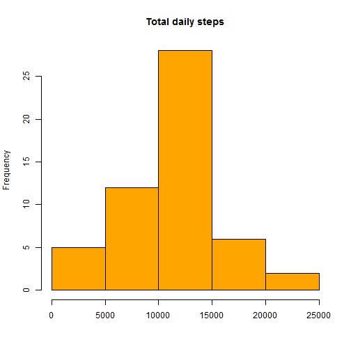
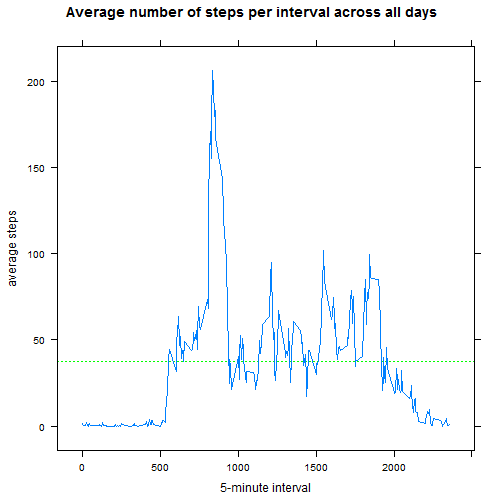
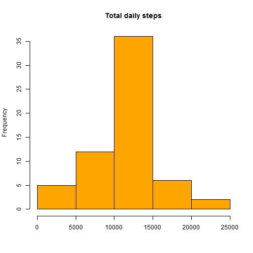
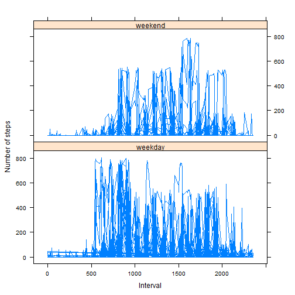

Loading and preprocessing the data

Load the data (i.e. read.csv())
Process/transform the data (if necessary) into a format suitable for your analysis


```r
import_data <- function (directory){
        
        ## file name, including root of the directory in where the .csv "activity" is located
        file_dir<-as.character(directory)
        
        ## read.csv for importing the data into our main variable "mydata"
        mydata <- read.csv(file_dir,header=TRUE,sep=",")
        nombres<-c("steps","date","interval")
        names(mydata)<-nombres
        mydata$date<-as.Date(mydata$date,format="%Y-%m-%d")
        
        return(mydata) 
}

dir<-"C:/Users/jmcarrillo/Documents/R/mydata_dir/activity.csv"

mydata<-import_data(dir)
```

Make a histogram of the total number of steps taken each day


```r
z <- aggregate(steps ~ date, data=mydata , FUN=sum)        
hist(z$steps,xlab="",main="Total daily steps",col="orange")
```

 

Calculate and report the mean and median total number of steps taken per day


```r
mean(z$steps)
```

```
## [1] 10766
```

```r
median(z$steps)
```

```
## [1] 10765
```

Draw a time series plot (i.e. type = "l") of the 5-minute interval (x-axis) and the average number of steps taken, averaged across all days (y-axis)


```r
z <- aggregate(steps ~ interval, data=mydata , FUN=mean)
library(lattice)
myplot<-xyplot(z$steps~z$interval,type="l",xlab="5-minute interval",,ylab="average steps",main="Average number of steps per interval across all days")
update(myplot, panel = function(...) {
    panel.abline(h = mean(z$steps),lty = "dotted", col = "green")
    panel.xyplot(...)
})
```

 

Which 5-minute interval, on average across all the days in the dataset, contains the maximum number of steps?


```r
z[z$steps==max(z$steps),]
```

```
##     interval steps
## 104      835 206.2
```

total number of missing values in the dataset


```r
total_num_na<-nrow(subset(mydata,is.na(mydata$steps)))
```

Devise a strategy for filling in all of the missing values in the dataset. The strategy does not need to be sophisticated. 
For example, you could use the mean/median for that day, or the mean for that 5-minute interval, etc


```r
library(plyr)
interval_mean <- aggregate(steps ~ interval, data=mydata , FUN=mean)
mydata1 <- join(mydata, interval_mean, by = "interval")
nombres<-c("steps","date","interval","steps1")
names(mydata1)<-nombres
mydata1$steps2<-ifelse(is.na(mydata1$steps),mydata1$steps1,mydata1$steps)
```

Create a new dataset that is equal to the original dataset but with the missing data filled in.


```r
mydata2<-mydata1[,c("steps2","date","interval")]
nombres<-c("steps","date","interval")
names(mydata2)<-nombres
head(mydata2)
```

```
##     steps       date interval
## 1 1.71698 2012-10-01        0
## 2 0.33962 2012-10-01        5
## 3 0.13208 2012-10-01       10
## 4 0.15094 2012-10-01       15
## 5 0.07547 2012-10-01       20
## 6 2.09434 2012-10-01       25
```

```r
tail(mydata2)
```

```
##        steps       date interval
## 17563 2.6038 2012-11-30     2330
## 17564 4.6981 2012-11-30     2335
## 17565 3.3019 2012-11-30     2340
## 17566 0.6415 2012-11-30     2345
## 17567 0.2264 2012-11-30     2350
## 17568 1.0755 2012-11-30     2355
```

Make a histogram of the total number of steps taken each day and Calculate and report the mean and median total number of steps taken per day. 


```r
z2 <- aggregate(steps ~ date, data=mydata2 , FUN=sum)
hist(z2$steps,xlab="",main="Total daily steps",col="orange")
```

 

```r
mean(z2$steps)
```

```
## [1] 10766
```

```r
median(z2$steps)
```

```
## [1] 10766
```

Do these values differ from the estimates from the first part of the assignment? 


```r
print("The median does, the mean does not.")
```

```
## [1] "The median does, the mean does not."
```

What is the impact of imputing missing data on the estimates of the total daily number of steps?


```r
print("It modifies the median of the distribution.")
```

```
## [1] "It modifies the median of the distribution."
```


Create a new factor variable in the dataset with two levels - "weekday" and "weekend",
indicating whether a given date is a weekday or weekend day


```r
mydata1$weekday<-weekdays(as.Date(mydata1$date,format="%Y-%m-%d"))
mydata1$weekend_weekday<-ifelse(mydata1$weekday=="sábado" | mydata1$weekday=="domingo","weekend","weekday")
```

Make a panel plot containing a time series plot (i.e. type = "l") of the 5-minute interval (x-axis) and the average number of steps taken, 


```r
myplot3<-xyplot(mydata1$steps~mydata1$interval|mydata1$weekend_weekday,type="l",xlab="Interval",ylab="Number of steps",layout=c(1,2))
myplot3
```

 
